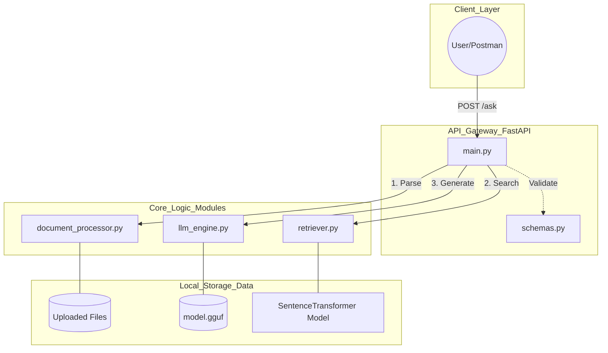
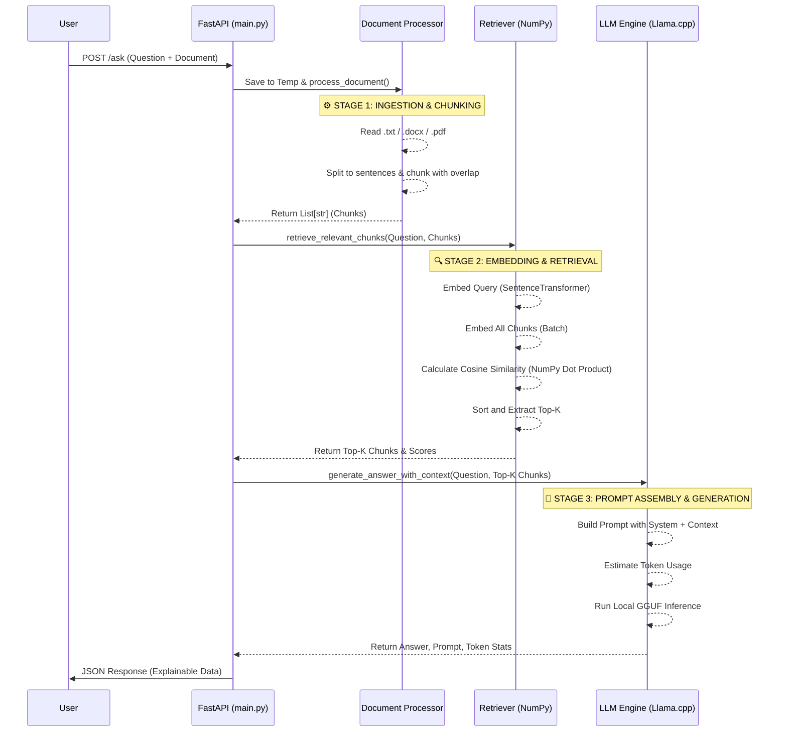

# 🔍 "AskDocx" Explainable Local RAG System

This is a lightweight, privacy-focused Local RAG (Retrieval-Augmented Generation) system. It allows you to have a context-aware conversation with your documents (.txt, .docx, and .pdf) without a single byte of data leaving your machine.

While most modern RAG stacks rely on complex cloud APIs and "black-box" frameworks, this project was built from the ground up to be transparent, fast, and entirely offline.

---

## 📁 Project Structure

```text
rag-technical-test/
├── main.py                  # FastAPI app, endpoints, dependency injection
├── document_processor.py    # File ingestion (.txt, .docx, .pdf) + manual chunking
├── retriever.py             # Embedding generation + manual cosine similarity
├── llm_engine.py            # Local GGUF model loading + prompt assembly
├── schemas.py               # Pydantic request/response models
├── requirements.txt         # Python dependencies
├── README.md                # This file
└── models/
    └── model.gguf           # Your local GGUF model (not included)
```

---

## 🚀 Quick Start

### 1. Install Dependencies

```bash
# Create virtual environment
python -m venv .venv
source .venv/bin/activate   # Linux/Mac
.venv\Scripts\activate      # Windows

# Install requirements
pip install -r requirements.txt
```

> **Note for Windows**: 
> This project uses `llama-cpp-python`, which requires a C++ compiler. 
> 1. Download [Visual Studio Build Tools](https://visualstudio.microsoft.com/visual-cpp-build-tools/).
> 2. During installation, check the workload: **"Desktop development with C++"**.
> 3. Restart your computer before running `pip install -r requirements.txt.`

### 2. Download a GGUF Model

Download any instruction-tuned GGUF model. Recommended options:

```bash
# Create models directory
mkdir -p models

# Download model Llama 3.1 8B (Quantization Q5_K_M ~5.73GB)
wget -O models/model.gguf [https://huggingface.co/bartowski/Meta-Llama-3.1-8B-Instruct-GGUF/resolve/main/Meta-Llama-3.1-8B-Instruct-Q5_K_M.gguf](https://huggingface.co/bartowski/Meta-Llama-3.1-8B-Instruct-GGUF/resolve/main/Meta-Llama-3.1-8B-Instruct-Q5_K_M.gguf)

```
### 3. Run the Server

```bash
python main.py
# Server starts at http://localhost:8000
# API docs at http://localhost:8000/docs
```

---

## 📡 API Usage

### `POST /ask`

Ask a question about an uploaded document.

**Request** (multipart/form-data):

| Field      | Type   | Required | Description                          |
|------------|--------|----------|--------------------------------------|
| `question` | string | ✅        | Your question about the document     |
| `document` | file   | ✅        | `.pdf` `.docx` or `.txt` file               |
| `top_k`    | int    | ❌        | Number of chunks to retrieve (def: 3)|

**cURL Example:**
```bash
curl -X POST "http://localhost:8000/ask" \
  -F "question=What are the main findings of this report?" \
  -F "document=@./your-document.pdf" \
  -F "top_k=3"
```

**Python Example:**
```python
import httpx

with open("document.txt", "rb") as doc_file:
    response = httpx.post(
        "http://localhost:8000/ask",
        data={"question": "What is the main topic?", "top_k": 3},
        files={"document": ("document.txt", doc_file, "text/plain")},
    )

result = response.json()
print(result["answer"])
print(result["similarity_scores"])
```

**Response Schema:**
```json
{
  "answer": "The main findings indicate...",
  "retrieved_documents": [
    "chunk text 1 that was most relevant...",
    "chunk text 2 that was second most relevant..."
  ],
  "similarity_scores": [0.8923, 0.7541],
  "prompt_used": "### System:\n...\n### Context:\n...\n### Answer:",
  "token_usage_estimation": {
    "prompt_tokens": 312,
    "completion_tokens": 87,
    "total_tokens": 399
  }
}
```

---

## 🏗️ Architecture & Design Decisions

### Why Manual RAG (No LangChain / LlamaIndex)?

| Aspect | Framework-based RAG | Manual RAG (This System) |
|--------|---------------------|--------------------------|
| **Transparency** | Black box internals | Every step is auditable |
| **Dependencies** | Heavy (100+ transitive deps) | Minimal and controlled |
| **Debugging** | Hard — framework magic | Easy-pure Python logic |
| **Performance** | Overhead from abstractions | Direct calls, no overhead |
| **Learning Value** | High-level only | Demonstrates deep understanding |

The core philosophy is **"understand what you build"**. In a production AI system, unexplained behavior is a liability. Manual implementation forces explicit decision-making at every step.

---

### 📄 Document Ingestion Strategy

The system supports **.txt, .docx, and .pdf** formats.

- **PDF Processing**: Added support via `PyMuPDF (fitz)`. Text is extracted per page, ensuring that even complex documents like certificates and academic reports can be processed into meaningful chunks.
- **Open/Closed Principle**: To add new formats (e.g., .md, .html), you only need to add a reader function in `document_processor.py` and register it in the `readers` dictionary—no other core logic needs modification.

---

### 🌐 Bilingual & Cross-lingual Support
Unlike basic RAG systems, AskDocx is optimized for Indonesian and English:

- **Language Detection**: The LLM automatically detects the user's question language and responds in the same language.

- **Cross-lingual Retrieval**: You can upload an English document (e.g., a recipe or certificate) and ask questions in Indonesian. The system will retrieve the correct English context and translate the answer on-the-fly.

- **System Instruction**: Explicitly tuned for Llama 3.1 8B to prevent "hallucination" and ensure strict adherence to the provided context.

---

## ⚙️ Configuration Reference

| Location | Constant | Default | Description |
|----------|----------|---------|-------------|
| `document_processor.py` | `DEFAULT_CHUNK_SIZE` | `5` | Sentences per chunk |
| `document_processor.py` | `DEFAULT_OVERLAP_SIZE` | `1` | Overlap sentences |
| `retriever.py` | `DEFAULT_TOP_K_RESULTS` | `3` | Chunks to retrieve |
| `retriever.py` | `DEFAULT_EMBEDDING_MODEL_NAME` | `all-MiniLM-L6-v2` | Embedding model |
| `llm_engine.py` | `DEFAULT_CONTEXT_WINDOW_SIZE` | `4096` | LLM context tokens |
| `llm_engine.py` | `DEFAULT_MAX_NEW_TOKENS` | `512` | Max output tokens |
| `llm_engine.py` | `DEFAULT_TEMPERATURE` | `0.1` | Ensures factual/deterministic answers |
| `llm_engine.py` | `DEFAULT_REPEAT_PENALTY` | `1.15` | Prevents word repetition |
| `llm_engine.py` | `stop_tokens` | `['<\|eot_id\|>']` | Llama-3 specific end-of-turn tokens |

---

## 🔧 Trade-offs & Known Limitations

| Limitation | Impact | Mitigation |
|------------|--------|------------|
| No vector persistence | Re-embeds every request | Acceptable for single-doc use case |
| CPU-only inference by default | 8B model is slower on older CPUs (e.g., i5-8th gen) | Used Q5_K_M Quantization to balance speed and intelligence. |
| Memory Management | 5.7GB Model on 16GB RAM | Implemented Manual Context Windowing (4096 tokens) to prevent "Out of Memory" crashes while maintaining long document support. |
| Token count is estimated | ±15% accuracy | Use actual tokenizer for billing-critical apps |
| No conversation history | Single-turn Q&A only | Add message history for multi-turn support |
| English-optimized embedding | Reduced quality for non-English | Swap to `paraphrase-multilingual-MiniLM-L12-v2` |

---

## 📊 Performance Evaluation (Self Locally Tested)

To ensure the system works reliably in real-world scenarios, it was tested using different types of documents (like a structured `EF SET Certificate.pdf` and a dense `recipe book.pdf`). Here is how the system performs:

1. **Spot-On Accuracy:** The manual search engine (built with NumPy) is highly precise. Whenever a question is asked, the most correct and relevant piece of text is consistently retrieved and placed right at the top of the results (`Passage 1`).
2. **Zero Hallucination (It Doesn't Guess):** Trust is critical in AI. If you ask a question and the answer is NOT in the uploaded document, the system won't make up a fake answer. It will honestly reply with *"Information not available"*.
3. **Smart Bilingual Support:** The system easily handles language barriers. You can upload a fully English document, ask a question in Indonesian, and the Llama 3.1 model will give you a natural, highly accurate Indonesian answer without sounding like a robot translator.
4. **Quality Over Speed:** Generating a complete answer takes about 15-30 seconds on a standard laptop (Intel i5 CPU). This is a deliberate choice: we use a highly intelligent "8B parameter" model to guarantee correct answers, rather than using a tiny model that replies instantly but gets the facts wrong.

---

### 🧱 Component Relationship Diagram



---

## 🗺️ Technical Architecture & Data Flow

Below is the system architecture diagram illustrating the component boundaries and data processing stages:


---

## 🧪 Running Tests

```bash
pytest tests/ -v
```

---

```markdown
## 🚀 Future Improvements
If this system were to be scaled into a larger production environment, the following improvements would be prioritized:
1. **Asynchronous LLM Inference:** Transitioning to an async-native LLM runner (like vLLM or `llama-cpp-python`'s asyncio server) to handle multiple concurrent requests without blocking the FastAPI event loop.
2. **Persistent Vector Database:** Replacing the in-memory NumPy approach with a dedicated vector database (e.g., Qdrant or Milvus) if the requirement evolves to support multi-document corpora and pre-indexed retrieval.
3. **Advanced Document Parsing:** Integrating OCR capabilities (e.g., Tesseract or unstructured.io) to support scanned PDFs and complex tables.
4. **Conversational Memory:** Adding a session management layer (e.g., using Redis) to store chat history, enabling multi-turn conversations rather than single-turn Q&A.

---
---

<p align="center"><b><i>End of Code — Annisa Dewiyanti</i></b></p>
